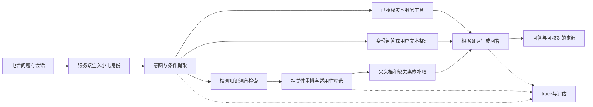

# 小电知识库诊断与知行迁移方案

日期：2026-09-07。目标：在电台真实对话中正确注入“小电”系统提示词，检索到适用的西电资料，并完整、准确地回答校园细节问题。

本文保留原始诊断、公开工程资料调研和完整迁移设计。后续已实现独立知识服务、BGE+BM25+RRF+重排、结构化问题理解、正文/OCR 重建和两端来源展示。原始性能数字和质量指标是验收目标，不是生产通过声明。

## 1. 结论与证据

当前系统已经有 RAG 的基本形态：先检索外部资料，再把资料交给模型生成回答。主要缺口是检索质量、资料质量、上下文理解和可观测性。不能根据用户反馈就断定生成模型能力不足；仓库默认模型是 `gpt-4o-mini`，生产实际模型、供应商行为和用户失败会话本次没有核验。

只读检查的是本地 `backend/data/treehole.db`，没有改写该数据库，也没有连接生产数据库。本地有 82 个知识来源、1,582 篇文档、4,149 个片段，检索日志为 0。历史抓取报告记录 2026-08-12 抓取 1,200 页，成功 1,055 页、失败 145 页；这组统计不代表今日知识覆盖率。

修复前的检索结果属于一次性本地验收产物，不作为当前索引能力证据。

下表描述修复前的实证与当时的处理方向，当前实现状态以第 7 节及实际验收记录为准。

| 问题 | 实际证据 | 影响与处理 |
|---|---|---|
| 系统身份和西电背景缺失 | 原 `_ai_handler.py` 仅写“电台的校园 AI 助手”，又要求只能依赖检索资料 | 无资料时连基本身份和常识也受到约束。本次已添加版本化核心提示词 |
| 只有词法检索 | `rag_service.py` 使用中文单字、2/3/4 字片段和倒排索引；`AI_EMBEDDING_MODEL` 只读取配置，没有调用、向量索引或重排序 | 口语、同义表达和长尾问题难以匹配。需迁移混合检索 |
| 词频失真与泛词噪声 | `_tokenize()` 先去重，`_add_document()` 再计数，词频实际全部为 1；单字“网”还能触发同义扩展 | BM25 类公式存在，但不是保留真实词频的标准实现；“怎么、哪些”等泛词可能支配排序 |
| 问题理解未进入检索 | `retrieve(db, question, ...)` 只接收当前问题 | 问“那北校区呢”，前三条是光电学院活动、期刊中心、体育荣誉；无法继承上一轮图书馆主题 |
| 商业广告进入高位结果 | “奖学金怎么申请，需要哪些材料”前两条来自商业保研机构主页 | 词面“材料”覆盖了真正事项“奖学金”；需正文清洗、类别路由和相关性重排序 |
| 抓取大量页面导航 | “校园网连不上怎么办”第一条是“教师主页”，后面是新闻；图书馆问题也命中招生宣传页和办事栏目列表 | 当前 HTMLParser 收集几乎全部页面文本，页脚和导航污染索引。`authority=official` 不能保证正文相关 |
| 日期无法判断适用性 | 1,582 篇文档都没有独立 `publishedAt`；抓取脚本用采集时间填 `createdAt` | 旧资料被呈现成新近资料。本次把提示中的“原文发布日期”和“入库时间”分开；历史数据仍需重建 |
| 同标题资料被丢弃 | 库内重复标题的多余片段数为 198；原检索按标题去重 | 不同年份或同标题不同正文可能缺失。本次改为相同正文去重；仍需父文档与片段关联 |
| 文档结构没有保留 | 按段落约 850 字切分、重叠 100 字，单段超长不会再切；不解析 DOCX/XLSX，扫描 PDF 没有 OCR | 表格、附件、例外条款容易漏掉。本地最长片段 4,072 字，未发现当前库超过 6,000 字截断线，不能把潜在截断当作本次实证 |
| “提取信息”存在假调用 | `/api/ai/post-selection` 原来仅返回“已根据选中文本整理：”加前 160 字 | 完全没有理解或提取。本次改为进入统一 AI 对话链路 |
| 当前问题重复发送 | Flutter 和小程序先把新问题加入历史，后端再追加一次 | 本次在后端消除尾部重复当前问题，并保留正常多轮历史 |
| 输出被压成一行 | `_clean_text()` 原来把全部空白变为空格 | 材料清单和步骤难以阅读。本次保留换行 |
| 缺少实际链路证据 | 旧日志仅有问题长度和来源键，最多 500 条；不记录问题理解结果、分数、版本和耗时 | 本次增加 traceId、静态 prompt 版本/hash、模型、词法检索分数和耗时；完整生产追踪另行落地 |

还有明确的知识陈旧例子：内置“西电本科生奖学金与国家助学资助参考”仍写国家励志奖学金 5,000 元、一般助学金 3,300 元。这与教育部 2024 年调整文件中的 6,000 元、平均 3,700 元不一致，且特殊对象须单独区分。不能通过全局数字替换修复，必须按原始文件、适用对象和生效时间重建知识条目。[教育部政策原文](https://hudong.moe.gov.cn/jyb_xxgk/moe_1777/moe_1779/202410/t20241029_1159726.html)

## 2. 系统提示词：已落地

唯一运行源为 `backend/services/_ai_prompt.py` 的 `SYSTEM_PROMPT`，当前版本 `xiaodian-2026-09-07.3`；`build_system_prompt()` 追加北京时间当前日期。可阅读同目录《小电系统提示词.txt》。不要再在各客户端维护不同的系统提示词。

开头为：

> 你叫“小电”，是西电知行平台智能助手，在电台中为用户提供帮助。

完整提示词还包括：西电全称、英文名、所在地、教育部直属、电子信息特色、211/双一流、建校与更名节点、校训、长安/南校区和雁塔/北校区对应关系及地址、学校/教务/招生/研究生院/图书馆/地图/一网通办入口。核心事实核对自[学校简介](https://www.xidian.edu.cn/xxgk/xxjj.htm)、[校园地图](https://gis.xidian.edu.cn/)、[微电子学院校训介绍](https://sme.xidian.edu.cn/m/list.php?tid=2)。人数、学院数量、领导名单、金额和开放时间等易变事实不放进长期静态提示词。

规则涵盖上下文理解、字段提取、数字与单位保留、办理条件/时间/材料/步骤提取、官方与同学经验区分、时效与冲突处理。基础信息可以直接回答；具体校园事实依赖适用的检索证据；一般写作、解释和用户文本整理正常提供帮助。

校园生成请求顺序是：`system（身份+核心信息+日期） → 本轮只读检索资料 → 补全后的独立问题`。历史用于前置问题理解，不把历史助手答案再次作为校园事实交给生成模型。一般聊天与文本整理保留最近历史。客户端不能提供 system 角色覆盖身份；当前问题只出现一次。选中文字接口也使用同一系统提示词、模型配置和 AI 计费限流链路。它仍受原有文本长度限制，完整附件与长文提取列入后续迁移。

静态 prompt hash 不含每天变化的日期。未来生产追踪还需保存实际请求 system 消息的 hash，才能证明某次请求的完整注入内容。

当前契约检查：14 项通过，包括模型请求中的身份/核心信息/资料/历史、忽略客户端伪造 system、当前问题去重、回答换行、同标题不同证据保留、原有检索行为和选中文字进入模型链路。模型传输使用替身；这不证明真实模型在生产上的回答正确率。

## 3. X、Instagram、小红书公开披露了什么

调研采用平台官方文档、工程博客和作者论文。没有公开证据证明这三家内部都使用同一套 Dify、LangChain、RAGFlow 或某个向量数据库；不能把推荐系统架构直接写成聊天助手的内部架构。

| 平台 | 可以确认的公开事实 | 知行可迁移的做法 | 证据边界 |
|---|---|---|---|
| X / xAI | Collections 提供文档集合、向量索引、元数据；检索支持关键词、语义和混合模式。X Search 是独立的 X 内容搜索工具 | 把私有知识库检索、公开社区搜索、互联网搜索划成独立工具，保留时间与来源元数据 | 这是官方对外 API 能力，不能据此声称完全知道 X 内部 Grok 的实现。[Collections](https://docs.x.ai/developers/files/collections)、[集合搜索](https://docs.x.ai/developers/files/collections/api)、[X Search](https://docs.x.ai/developers/tools/x-search) |
| Instagram / Meta | Meta AI 已进入 Instagram 等产品的搜索入口；Instagram Explore 工程文章公开了多阶段候选召回和排序、双塔向量召回和 ANN | 候选召回扩大覆盖，精排提高相关性，最终生成只接收精选证据；推荐排序与问答证据排序使用不同目标 | Explore 文章讨论推荐系统。Meta AI 产品公告不能证明其具体知识库、切片算法或 Agent 框架。[Meta AI 公告](https://about.fb.com/news/2024/04/meta-ai-assistant-built-with-llama-3/)、[Explore 工程文章](https://engineering.fb.com/2023/08/09/ml-applications/scaling-instagram-explore-recommendations-system/) |
| 小红书 | QP-OneModel 论文描述已部署的统一查询理解，结构化输出实体、分词、词权重、类别和意图描述；上下文包含用户改写历史及候选笔记 | 先提取事项、校区、院系、年级、学年和意图，再改写检索问题；运营规则与会话上下文共同影响理解 | 论文证明查询理解组件的实践，不等于公开了“问一问”完整 Agent/RAG 栈；不照搬它的训练规模。[作者论文，2026-02](https://arxiv.org/html/2602.09901v1) |

共同工程启发：问题理解、候选召回、相关性排序、来源与时效、结果可追踪，比单纯把大量文本塞进提示词更关键。这是针对知行的设计归纳，不是“三家采用完全相同技术栈”的事实判断。

## 4. 成熟方案比较与推荐

| 方案 | 优点 | 对本项目的代价 | 决策 |
|---|---|---|---|
| 自托管 Dify | 知识库维护、检索测试、混合检索和 rerank 配置、应用工作流现成 | 需要接现有登录、论坛权限、来源展示；与现有后台形成两套管理入口 | 若主要瓶颈是非技术人员维护知识库，可作为替代路线。[官方检索配置](https://docs.dify.ai/en/cloud/use-dify/knowledge/create-knowledge/setting-indexing-methods) |
| RAGFlow | 文档解析、复杂文档知识库与引用能力集中 | 整套系统运维资源明显高于当前 Python+SQLite 服务；需独立部署 | 大量扫描手册、复杂表格成为主数据时优先评估。[官方快速开始](https://ragflow.io/docs/) |
| 知行现有后端 + Qdrant + 成熟模型与解析器 | 保留电台入口、身份认证、论坛权限和后台；可单独衡量每个阶段 | 需要实现小规模摄取与检索服务、知识管理元数据 | **推荐路线**，按当前 4,149 片段规模实施即可，不构建大平台规模的训练系统 |
| LangGraph 编排 | 多步骤状态、工具调用和调试较清晰 | 首版固定检索流程引入图框架并非必要 | 等确实需要多轮检索和工具编排时引入；第一版普通 Python 工作流即可。[官方工作流/Agent 区别](https://docs.langchain.com/oss/python/langgraph/workflows-agents) |

推荐模型基线为 BGE-M3 向量/稀疏检索与 bge-reranker-v2-m3 精排。前者生成语义向量与稀疏权重，后者直接比较“问题—片段”相关性。它们是候选基线，必须使用西电题库验证；精排分数不能直接解释为答案正确概率。[BGE-M3](https://github.com/FlagOpen/FlagEmbedding/blob/master/docs/source/bge/bge_m3.rst)、[reranker](https://github.com/FlagOpen/FlagEmbedding/blob/master/examples/inference/reranker/README.md)

Qdrant 的混合查询和 RRF 排名融合可以作为成熟检索基础。RRF 根据各路名次融合，不直接相加量纲不同的关键词与向量分数。选 BGE 稀疏向量时应称为“稀疏+稠密检索”，不要标成 BM25；如果采用标准 BM25，需真实中文分词和词频实现。[Qdrant 混合查询](https://qdrant.tech/documentation/search/hybrid-queries/)、[混合检索与重排示例](https://qdrant.tech/documentation/tutorials-basics/reranking-hybrid-search/)

## 5. 知行目标链路



### 5.1 查询理解：把“那北校区呢”变成能搜索的问题

使用一次结构化模型调用读取当前问题与最近有效历史，输出以下内部结构：

```json
{
  "intent": "campus_qa",
  "standaloneQuery": "西电雁塔校区图书馆周末开放时间",
  "queries": ["雁塔校区 图书馆 周末 开放时间", "北校区 图书馆 开馆 闭馆"],
  "campus": "yanta",
  "department": null,
  "educationLevel": null,
  "enrollmentYear": null,
  "academicYear": null,
  "asOfDate": "2026-09-07",
  "requestedFields": ["周末开放时间", "假期例外"],
  "needsClarification": false
}
```

事项提取优先于泛词。校园网故障不能被改写成“教师主页”；“材料”应依附“奖学金申请”。区分“2024级学生”和“2024年发布通知”，不可混用。已有校区条件在追问中继承；用户换话题时取消不再相关的条件。新输入明确的条件优先于历史。一般资料不足无需阻塞全部回答，先提供可确定部分；必要歧义才追问。

身份/学校基础信息直接走核心提示词；对用户提供文本的字段提取直接处理原文；具体校园事务走 RAG；余额、课表和预约余量走真实授权接口。这些路径分别验收，不要求每一个问候都触发 RAG。

### 5.2 混合召回与精排

第一版建议参数：每个问题最多生成 3 个检索表达；各路候选取 30 条；合并到 60 条以内交精排；最终提供约 8–12 个片段，并受实际模型 token 预算控制。这些参数由题库调优，不是固定正确答案。

1. 稠密向量召回覆盖“连不上网/无法认证”等语义变化；稀疏或标准 BM25 召回保留楼号、课程名、年份、材料名等精确词。
2. 学校政策默认检索官方/核验资料。用户问“同学体验、踩坑、食堂口味”才加入社区证据；混合问题分开检索后解释来源差异。
3. 校区、年级等明确不匹配的条目不能支持结论。缺少适用字段的旧资料不应被全部硬过滤掉，可作为待核对候选，但不能当成已确认适用的政策。
4. 用 RRF 合并排名，再使用 reranker；校区、年份和来源适用性在召回与精排后均可检查。相关性分数阈值用已标注问题校准，不盲目照抄 0.5。
5. 保留命中片段的父文档、相邻条款、表头与单位；同一政策的条件和材料位于两个片段时一起提供。限制同一文档占满候选，并保证用户要求的不同子问题有覆盖。
6. 复杂问题允许最多一次针对缺失字段的补充检索，例如已经找到报名时间但未找到材料。到达预算仍缺资料时明确缺项，不编造。

类似“给片段补充文档级上下文”有成熟公开实践；知行先用可靠元数据（文档标题、章节、校区、日期）构造上下文，再评估是否需要模型生成的上下文摘要。[Anthropic Contextual Retrieval](https://www.anthropic.com/engineering/contextual-retrieval)

### 5.3 回答与证据

办理问题统一检查：适用对象、条件、时间、材料、步骤、入口、例外。答案中的金额、截止时间、联系方式、校区等必须能对应到支持片段；不能只因为文章在学校域名下就相信是当前适用规定。

目标是维护 `claim → chunkId → documentId → 原文URL/页码/原文日期`。当前已实现回答级 sourceIds 及对应原文信息，返回官方知识和论坛来源，Flutter 显示“回答依据”并打开原文；逐句 claim 对齐与验证尚未实现。来源区只列模型声明实际使用且属于本轮上下文的资料，不能把全部召回结果都包装成“引用过”。

没有资料支持的字段标记为未查到；检索服务出错要报告检索失败，不能伪装成“学校没有相关政策”。保留模型一般帮助能力，不加入自动编造答案的备用路径。

## 6. 西电知识数据如何做到细致

### 6.1 建立覆盖矩阵

| 领域 | 必须覆盖的细节 | 主要来源/责任 |
|---|---|---|
| 学校与校区 | 校区别名、地址、楼宇、地图、常用入口 | 官网、GIS；平台知识运营 |
| 本科教务 | 学籍、选课、补退选、考试、缓考、补考、转专业、培养方案 | 本科教务及学院原文；教务主题维护人 |
| 研究生 | 培养环节、导师选择、开题、中期、答辩、学位、招生复试 | 研究生院、学院原文；研究生主题维护人 |
| 奖助与学生事务 | 各类奖助适用对象、金额、排名条件、材料、申请时间、学院差异 | 学工部门、资助通知、学院通知；学生事务维护人 |
| 图书馆 | 两校区时段、节假日通知、借阅续借、座位预约和违约规则 | 图书馆公告和服务指南 |
| 网络与信息服务 | 统一认证、校园网故障分类、校外访问、一网通办 | 信息网络技术中心及服务指南 |
| 住宿与后勤 | 宿舍区域、缴费入口、额度/收费依据、维修、热水、校车 | 后勤、财务、迎新原文；生活主题维护人 |
| 招生就业交流 | 对应年度简章、录取/复试条件、就业手续、交流申请 | 招生、就业、国际合作部门与学院 |
| 健康体育校园生活 | 校医院服务入口、体育场馆预约、社团活动 | 相应部门、平台公开内容；医疗问诊不作为校园知识库替代业务 |
| 知行平台 | 发帖、可见性、认证、举报、隐私、AI 能力边界 | 当前实际产品功能、后台维护的产品说明 |

每个主题按校区、培养层次、年级/学年标出“有当前证据、只有历史证据、缺失、需要授权接口”。没有填满矩阵不能称为“西电各方面覆盖”；不以爬虫页数代替覆盖率。

### 6.2 清洗与文档结构

HTML 用 Trafilatura 提取正文和元数据，校内站点再加少量明确的模板定位；原 HTML 存档便于复核。栏目页用于发现链接，不作为问答正文。去掉导航、友情链接、页脚、推荐新闻及商业广告正文。[Trafilatura 文档](https://trafilatura.readthedocs.io/en/latest/)

原方案考察了 Docling；当前实际实现采用 pypdf、python-docx、openpyxl、pypdfium2 与 RapidOCR，旧 DOC/XLS 通过 LibreOffice 转换。HTML 表格保留行列文本，图片式公告和扫描 PDF 可 OCR 并保留页码；复杂扫描表格的行列关系和 OCR 数字准确性仍需逐项复核，尚未采用 Docling 的布局重建。[Docling 支持格式与 OCR](https://docling-project.github.io/docling/)

片段沿章节和完整条款切分，建议 400–800 中文字起步；表格按记录切分时重复表头、单位和适用范围。保存全文与片段顺序。只以内容散列及原文身份去重，不能用标题去重。模型抽取的发布日期和适用范围必须附原文证据，缺失字段保持 null。

### 6.3 数据契约

建议从 `settings.radioState` 中的知识数组迁出到独立知识 SQLite 文件和关系表，业务主库不整体迁移。原文放持久化对象存储/文件目录；Qdrant 只存检索向量与必要 payload。

```text
knowledge_source:
  id, name, origin_url, authority, owner, crawl_policy, refresh_interval, enabled
knowledge_document:
  id, source_id, canonical_url, title, raw_object_key, content_hash,
  published_at, fetched_at, effective_from, effective_to,
  academic_year, enrollment_year, campus, department, education_level,
  status, supersedes_id, parser_version
knowledge_chunk:
  id, document_id, revision, section_path, ordinal, text, page_number,
  evidence_offsets, content_hash, embedding_model, index_version
knowledge_ingestion_job:
  id, document_id, stage, status, error, started_at, finished_at
```

时间字段相互独立：`published_at` 是原文日期，`fetched_at` 是抓取日期，`effective_*` 是有效期，学年与入学年份单独保存。不要从 URL 中的年份直接推断政策生效时间。

论坛使用独立集合/来源过滤，继续按当前公开、审核通过、未删除权限控制；修改为私密或删除后要删除向量，并在生成前向业务数据核验可见性。个人课表、余额、成绩不进入全校共享知识库。

### 6.4 更新机制

普通办事指南每日增量抓取；招生、考试、转专业与奖助申请季按主题缩短到 2–6 小时；基础学校介绍每周检查。当前已提供每日官方刷新和每分钟论坛同步的 systemd 定时任务模板，目标 Linux 主机尚未启用或验证；分主题刷新频率仍待运营配置。

依据 canonical URL + 内容 hash 判断变化。内容变更生成新 revision，清理旧片段向量，再发布完整版本；同一 URL 的内容变化不能遗留旧片段。对于废止或被替代的政策记录 supersedes 关系，允许历史问题查询历史版本。403/超时代表抓取失败，不等同于政策撤销。

知识后台显示最近成功抓取、原文日期、失效文档、解析失败、领域覆盖缺口。失败问题按“缺资料/没召回/排错/答错/接口失败”分类，运营补资料，工程修检索，不能全靠改提示词。

## 7. 仓库迁移任务与发布

当前状态：P0 已完成；P1 已重建 567 份已发布校园文档，但领域覆盖矩阵未填满；P2 核心混合检索已运行，尚未完成大规模盲测指标验收；P3 三个接口与 Web 来源跳转已接通，小程序真机、流式输出与反馈闭环仍未验收；P4 仅进行了本地部分场景，未上线。下表是完整设计目标及最初估算，不是完成声明。

| 阶段 | 工作与文件落点 | 完成判定 | 估算 |
|---|---|---|---|
| P0 已做 | `services/_ai_prompt.py`；`handlers/_ai_handler.py`；`rag_service.py`；选中文本接口；小程序欢迎语 | 本地契约检查通过；生产尚未发布 | 本次交付 |
| P1 数据重建 | 改造 `scripts/crawl_xidian_rag.py`；新增正文/附件解析与 `knowledge_repository`；修订内置 seed 来源 | 30 个关键办理事项每项有可追溯原文；清除广告、栏目噪声；时间与适用范围可查 | 3–5 工程日，运营并行补内容 |
| P2 检索升级 | 新增 `query_understanding`、`hybrid_retriever`、`reranker`、`context_builder`；把 `rag_service.retrieve` 改为统一检索入口 | 固定题集上召回与精排指标达标；能正确检索追问和同义表达 | 3–4 工程日 |
| P3 对话集成 | `/api/ai/chat`、`/api/ai/search`、`/api/ai/post-selection` 共用检索服务；Flutter/小程序来源区域、流式输出、反馈 | 同一个问题三个入口语义一致；真实 UI 到模型可追踪 | 2–3 工程日 |
| P4 验收与上线 | 整理盲测题、生产同配置验收、灰度切换索引 | 满足第 8 节；每条失败有归因与修复记录 | 2–3 工程日 |

合计约 10–15 工程日，不含需要学校提供的非公开资料和授权接口等待时间。只是工作量估计；人员、服务器配置和实际领域缺口未核验。

保留现有 Docker 离线发布流程。在构建机生成并固定 backend、知识 worker、Qdrant 和模型服务镜像，记录镜像 digest 与模型 revision，再离线加载到生产。当前应用 Docker 使用 Python 3.10；解析器/模型服务应独立使用其支持的 Python 版本，避免强行把重依赖放入业务进程。

新增持久卷保存知识库、原始文档和 Qdrant 数据；写入 worker 与只读检索职责分开。最初可单机 Qdrant，先测本机资源与吞吐后配置，不为几千个片段直接引入分布式集群。4,149 个 1,024 维 float32 稠密向量的裸数据约 16.2 MiB；这不含索引、payload、稀疏向量、缓存及模型内存，不能当作服务器总内存需求。

没有 GPU 时优先评估可在生产网络访问的 embedding/rerank 服务，单独配置与生成模型分离的地址、密钥和模型；不能假定现有聊天供应商支持这两个接口。模型切换若改变向量空间，必须全量重建新索引。

原方案考虑下列远程 embedding/rerank 配置。当前采用独立自托管 BGE 服务，实际配置以仓库根目录 `.env.example` 为准；已支持 `BACKEND_RAG_URL`，其余远程模型 API 配置尚未实现：

```text
BACKEND_RAG_URL
BACKEND_AI_EMBEDDING_BASE_URL / BACKEND_AI_EMBEDDING_API_KEY
BACKEND_AI_EMBEDDING_MODEL
BACKEND_AI_RERANK_BASE_URL / BACKEND_AI_RERANK_API_KEY
BACKEND_AI_RERANK_MODEL
BACKEND_RAG_INDEX_VERSION
```

成本按实际供应商报价计算：月成本 = 常驻基础服务成本 + 新增/变化资料的 embedding 用量 + 问题理解输入输出用量 + 查询 embedding 用量 + rerank 用量 + 最终回答输入输出用量。分别记录模型 tokens、候选数量、缓存命中和每问费用；本次不编造人民币预算或指定采购机型。

新增查询理解调用会增加耗时。旧客户端总等待仅 55/60 秒，目前两端已调整为 165 秒。建议普通问题 P95 完整回答 ≤20 秒、检索+精排 P95 ≤2 秒作为起始目标，复杂补检问题 ≤35 秒；流式首字 P95 ≤5 秒。超时上限不代表实际延迟达标，仍需在计划并发与同等网络环境实测；模型服务冷启动、电脑休眠中断另记，不混入稳定态数字。

发布顺序：导出当前库只读快照 → 清洗重建 `zhixing_knowledge_v2` → 跑同题离线对照 → 在预发布电台验收 → 小流量灰度 → 切换活动集合。保留 v1 供人工回滚；运行中出现 v2 故障要明确暴露，不自动切回低质量检索并隐藏问题。回滚按发布版本与索引版本成对切换，不能只回滚代码。

## 8. 最终验收：必须从电台真实入口完成

### 8.1 题集与正确答案

建立 240 题：身份/基础 20、单主题办事细节 120（上述领域各有覆盖）、多轮追问 40、跨文档比较 20、文本/表格提取 20、过期/冲突/缺资料与权限 20。随机保留 60 题不参与调参。本文同目录另附 36 条起始验收场景，用于扩展和人工检查，不把这 36 条冒充完整金标准题集。

每题记录：问题与历史、适用条件、资料快照日期、gold document/chunk IDs、必须出现的事实字段、禁止出现的错误、预期路径（core/RAG/text/tool）、期望来源。金额和截止日期先由人对照原文确认，再评模型。让模型自己出答案再自己判分不足以验收。

### 8.2 指标

| 验收项 | 目标与计算方式 |
|---|---|
| 系统 prompt 注入 | 两客户端及选中文本入口所有验收请求 100% 注入指定身份、当前静态版本及日期；实际出站消息首条为 system；新问题不重复 |
| 检索路径 | 所有需要校园细节证据的题 100% 留下真实检索记录；身份和原文提取题允许不检索 |
| 候选证据召回 | 需 RAG 题的 gold 片段 Recall@30 ≥95%；按每题所需片段被召回比例算宏平均；另外报告各领域值 |
| 最终证据覆盖 | 需 RAG 题在最终上下文中包含全部必要证据的比例 ≥90%；多条件问题每个关键条件都要覆盖 |
| 事实正确率 | 人工判定的原子事实正确数/生成的可核验事实数 ≥95%；金额、日期、电话、政策对象错误单列，关键用例为零 |
| 回答完整度 | 正确回答的必需字段数/题目预定义必需字段数 ≥90%；不能通过大量“不确定”提高正确率 |
| 多轮 | 40 题中至少 38 题正确继承或更新校区、事项、时间；不得把上一主题强加给新主题 |
| 原文提取 | 数字、单位、日期、对象字段精确匹配 ≥98%；文本缺失字段不补造 |
| 来源支持 | 每个生成的来源链接都来自实际证据；人审支持答案的引用比例 ≥95%；关键办理事实均有证据 |
| 边界题 | 虚构地点、错误前提、失效资料、不可见论坛、无授权个人数据等指定场景全部处理正确；不能拒答已在库中完整覆盖的普通问题 |
| 体验 | 在约定并发（建议先测 10 个同时提问）与暖态模型环境满足上述 P95；记录错误率，推荐 <1% |

“回答西电各方面”通过领域矩阵和题集覆盖定义。未公布的新政策、未提供的内部文件和用户个人数据不可能靠静态 prompt 保证正确，必须接入对应资料或授权工具后再验收这些范围。

### 8.3 每个真实 UI 用例的证据链

1. 在 Flutter 电台和小程序分别登录正常账号提问，记录 API 返回的 traceId；多轮必须在同一会话中执行。
2. 预发布受控记录实际模型请求：system 文本/hash、promptVersion、当前日期、消息顺序；密钥不入日志。仅打印版本名不能证明真正发给模型。
3. 同一 trace 记录原始问题（受控验收环境）、独立检索问题、继承条件、每路候选 ID/分数、精排结果、最终 chunk revision 和实际注入内容的 hash。
4. 对照原文快照核对最终回答的日期、数值、校区、对象、材料、步骤及例外，再检查前端渲染、换行、链接和追问。
5. 加一个只存在于预发布知识库的人工验收文档，使用模型不可能预先知道的临时服务名称和随机办理码，检查能否真实召回并准确回答；删除或禁用后不得再注入该文档。该合成文档不发布到真实知识库。
6. 保存题号、traceId、资料版本、实际回答、字段评分、失败分类和截图/请求证据；生产普通日志默认不长期保存完整敏感对话，验收会话单独控制保存范围。

验收失败归因顺序：库里有没有原文 → 条件理解对不对 → gold 是否进入候选 → 是否被精排或截断丢掉 → 实际模型请求是否含正确 prompt/证据 → 回答是否误读 → 前端是否显示完整。这个顺序能直接定位问题，不再凭“感觉不智能”反复换模型。

## 9. 当前完成边界

已完成：只读诊断和坏例复现；“小电”系统提示词与核心事实；重复历史和换行修复；真实模型原文提取；独立规范库和向量库；中文 BM25+BGE 向量+RRF+BGE 重排；结构化问题与追问改写；HTML/部分 Office 与 OCR 解析；官方来源展示；本地 Web 原文跳转；真实增量更新、替代、禁用与论坛可见性检查。验收记录区分实际模型运行与契约测试，不能相互替代。

尚未完成：所有领域的现行细节资料覆盖、复杂 OCR 表格复核、240 题金标准与盲测、并发/延迟指标、流式输出与反馈闭环、小程序真机和正式 CAS 登录、目标 Linux 主机与生产验收。本地小模型的无证据电话号码和输出格式问题已在固定回归中修复；当前未做全领域质量验收，不能签署完整“西电细节问答验收通过”。生产主机按用户要求由同事手动部署。用户现阶段要求停止扩量，先交付本地正式问答链路。
